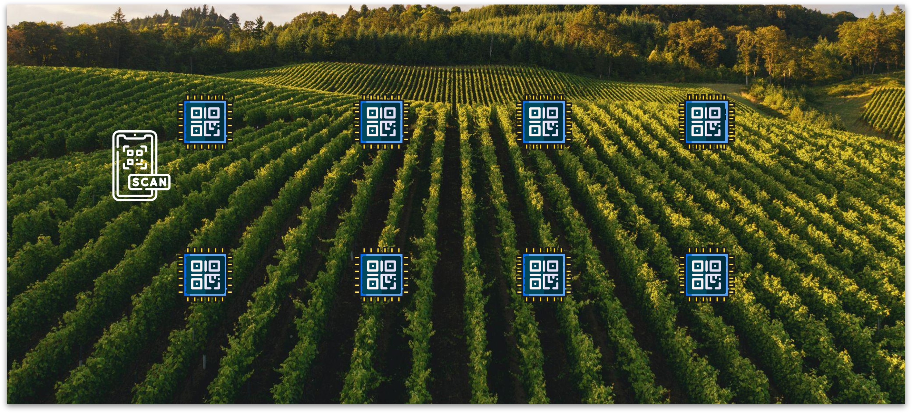
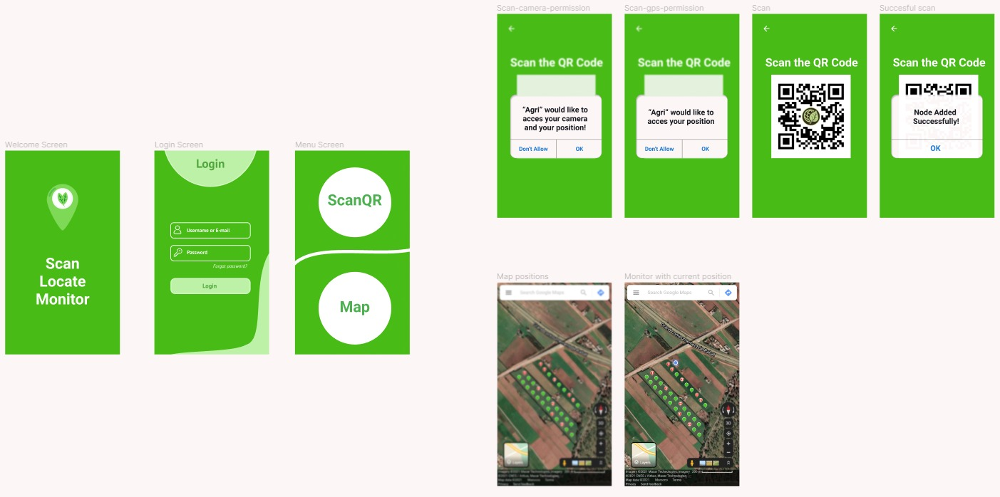

# Localization-of-Static-Node-Sensor-using-Mobile-App

A mobile application that allows the localization of sensor nodes in a static wireless sensor network. It is based on Flutter and Firebase.

# Problematic

Let's take an example in the field of agriculture. To monitor a very large area of land, we need to implement several nodes on different parts of the land. So we have a big wireless sensor network. The question is how to determine the position of each node in this network and the obvious answer is to use a GPS module for each node, which is not practical at all since the cost, the consumption of energy will increase, also we need to acquire their position only once because they are static. Another solution that I found on this [research paper](https://www.ijmter.com/papers/volume-5/issue-3/node-localization-in-wireless-sensor-networks-an-overview.pdf), is to implement a complex algorithm that is based on RSSI, ToA, TDoA, AoA with other parameters. The drawback is that it will take a lot of time to understand the parameters and to implement them. That's why we proposed a cheap, efficient, easy to implement and to use solution.

# Our Solution

We propose a Mobile Application that allows to locate the different nodes, simply by scanning their QR code. In fact, each node will have a label printed on it a QR code that uniquely identifies it. Then, the user, when implanting the nodes in the ground for the first time, will scan the QR code then the mobile application will acquire the GPS position of the phone in the moment of the scan and sends the informations to the FireBase database. Also the mobile application offers the possibility to preview all the nodes positions on a map. Please refer to the demo video to see how it works.

# Demonstration Video

Watch the "Demonstration_Video.mp4" on this repo.

# Used Technologies

We used **Flutter** because it's a lot **easier** than programming with Java in Android Studio. There are **custom**, **animated UI** of any complexity **available** also **easy to implement** dart packages [here](https://pub.dev/). Last but not least, with the "**hot reload**" and "**hot restart**" you can reduce code development time.

For the authentification verification and the storing of data, we used Firebase palteform to perform both of them. Since it's free and fast to host.

# Wireframing

